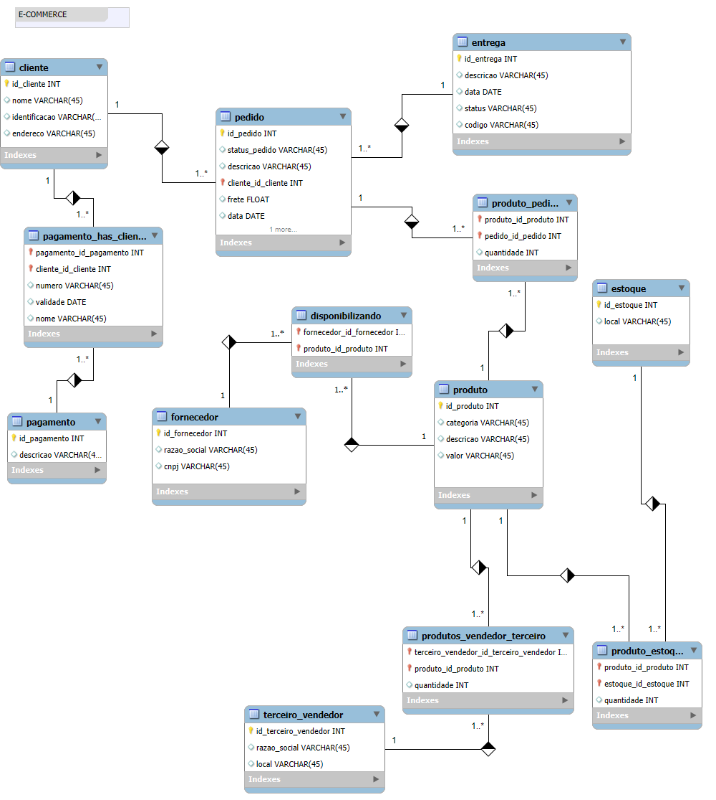
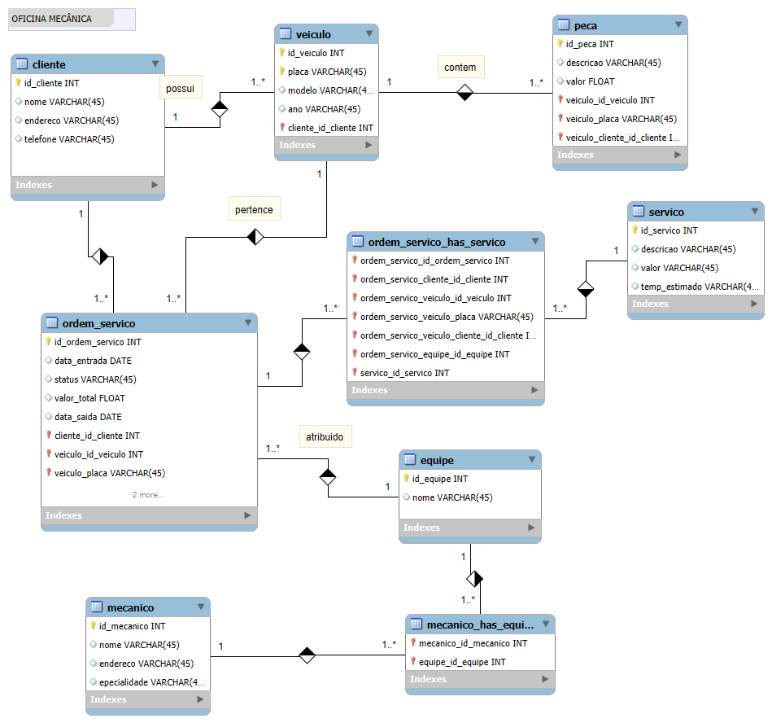

# Desafio Banco de Dados DIO 

## Descrição do Desafio 1 - E-Commerce

O esquema deverá ser adicionado a um repositório do Github para futura avaliação do desafio de projeto. Adicione ao Readme a descrição do projeto conceitual para fornecer o contexto sobre seu esquema.

### Objetivo:

Refine o modelo apresentado acrescentando os seguintes pontos:

- Cliente PJ e PF – Uma conta pode ser PJ ou PF, mas não pode ter as duas informações;
- Pagamento – Pode ter cadastrado mais de uma forma de pagamento;
- Entrega – Possui status e código de rastreio;

## Descrição Desafio 2 - Oficina Mecânica

### Objetivo:

Cria o esquema conceitual para o contexto de oficina com base na narrativa fornecida

### Narrativa:

- Sistema de controle e gerenciamento de execução de ordens de serviço em uma oficina mecânica
- Clientes levam veículos à oficina mecânica para serem consertados ou para passarem por revisões  periódicas
- Cada veículo é designado a uma equipe de mecânicos que identifica os serviços a serem executados e preenche uma OS com data de entrega.
- A partir da OS, calcula-se o valor de cada serviço, consultando-se uma tabela de referência de mão-de-obra
- O valor de cada peça também irá compor a OSO cliente autoriza a execução dos serviços
- A mesma equipe avalia e executa os serviços
- Os mecânicos possuem código, nome, endereço e especialidade
- Cada OS possui: n°, data de emissão, um valor, status e uma data para conclusão dos trabalhos.

## Descrição do Desafio 3 - Projeto Lógico E-Commerce

Replique a modelagem do projeto lógico de banco de dados para o cenário de e-commerce. Fique atento as definições de chave primária e estrangeira, assim como as constraints presentes no cenário modelado. Perceba que dentro desta modelagem haverá relacionamentos presentes no modelo EER. Sendo assim, consulte como proceder para estes casos. Além disso, aplique o mapeamento de modelos aos refinamentos propostos no módulo de modelagem conceitual.

### Crie queries SQL com as cláusulas abaixo:

- Recuperações simples com SELECT Statement
- Filtros com WHERE Statement
- Crie expressões para gerar atributos derivados
- Defina ordenações dos dados com ORDER BY
- Condições de filtros aos grupos – HAVING Statement
- Crie junções entre tabelas para fornecer uma perspectiva mais - complexa dos dados

### Objetivo:

*“Refine o modelo apresentado acrescentando os seguintes pontos”*

- Cliente PJ e PF – Uma conta pode ser PJ ou PF, mas não pode ter as duas informações;
- Pagamento – Pode ter cadastrado mais de uma forma de pagamento;
- Entrega – Possui status e código de rastreio;

**Algumas das perguntas que podes fazer para embasar as queries SQL:**

- Quantos pedidos foram feitos por cada cliente?
- Algum vendedor também é fornecedor?
- Relação de produtos fornecedores e estoques;
- Relação de nomes dos fornecedores e nomes dos produtos;

### Resultados

[Arquivo de criação do banco de dados E-commerce](e-commerce/03_bd_e-commerce.sql)

[Arquivo da inserção de dados e queries - E-commerce](e-commerce/03_queries_and_data_insertion.sql)

## Descrição do Desafio 4 - Projeto Lógico Oficina

### Descrição

Para este cenário você irá utilizar seu esquema conceitual, criado no desafio do módulo de modelagem de BD com modelo ER, para criar o esquema lógico para o contexto de uma oficina. Neste desafio, você definirá todas as etapas. Desde o esquema até a implementação do banco de dados. Sendo assim, neste projeto você será o protagonista. Tenha os mesmos cuidados, apontados no desafio anterior, ao modelar o esquema utilizando o modelo relacional.

Após a criação do esquema lógico, realize a criação do Script SQL para criação do esquema do banco de dados. Posteriormente, realize a persistência de dados para realização de testes. Especifique ainda queries mais complexas do que apresentadas durante a explicação do desafio. Sendo assim, crie queries SQL com as cláusulas abaixo:

- Recuperações simples com SELECT Statement;
- Filtros com WHERE Statement;
- Crie expressões para gerar atributos derivados;
- Defina ordenações dos dados com ORDER BY;
- Condições de filtros aos grupos – HAVING Statement;
- Crie junções entre tabelas para fornecer uma perspectiva mais complexa dos dados;

[Arquivo de criação do banco de dados Oficina](oficina/04_bd_oficina.sql)

[Arquivo da inserção de dados e queries - Oficina](oficina/04_queries_and_data_insertion.sql)

## Desafio 5 

### 5.1 Criando índices em Banco de Dados 

### Descricao 

Criação de índices para consultas para o cenário de company com as perguntas (queries sql) para recuperação de informações. Sendo assim, dentro do script será criado os índices com base na consulta SQL.  

**Perguntas:**

- Qual o departamento com maior número de pessoas? 
- Quais são os departamentos por cidade? 
- Relação de empregrados por departamento 

**Entregável:** 

- Crie as queries para responder essas perguntas 
- Crie o índice para cada tabela envolvida (de acordo com a necessidade) 
- Tipo de indice utilizado e motivo da escolha (via comentário no script ou readme) 

### Resultado 

- [Script SQL para criacao do banco de dados company](company/create_db_company.sql)
- [Script SQL para insercao de dados no banco de dados company](company/index_db_company.sql)
- [Script SQL para criacao dos indicies](company/create_db_company.sql)

1. O índice `idx_employee_dno` melhora a eficiência da consulta para contar empregados por departamento, especialmente em tabelas grandes.
2. O índice `idx_dept_location_dnumber` otimiza a busca de departamentos por cidade, já que a tabela `dept_location` será filtrada frequentemente pelo atributo `d_number`.
3. O índice `idx_department_dnumber` acelera as junções entre `department` e outras tabelas, essencial para diversas consultas, como a relação de empregados por departamento.

### 5.2 - Utilização de procedures para manipulação de dados em Banco de Dados 

#### Objetivo:  

Criar uma procedure que possua as instruções de inserção, remoção e atualização de dados no banco de dados. As instruções devem estar dentro de estruturas condicionais (como CASE ou IF).  

Além das variáveis de recebimento das informações, a procedure deverá possuir uma variável de controle. Essa variável de controle irá determinar a ação a ser executada. Ex: opção 1 – select, 2 – update, 3 – delete. 

Sendo assim, altere a procedure abaixo para receber as informações supracitadas. 

**Entregável:**

Script SQL com a procedure criada e chamada para manipular os dados de universidade e e-commerce. Podem ser criados dois arquivos distintos, assim como a utilização do mesmo script para criação das procedures. Fique atento para selecionar o banco de dados antes da criação da procedure.  

#### Resultado

- [Script SQL para criacao da procedure](company/procedure_db_company.sql)

